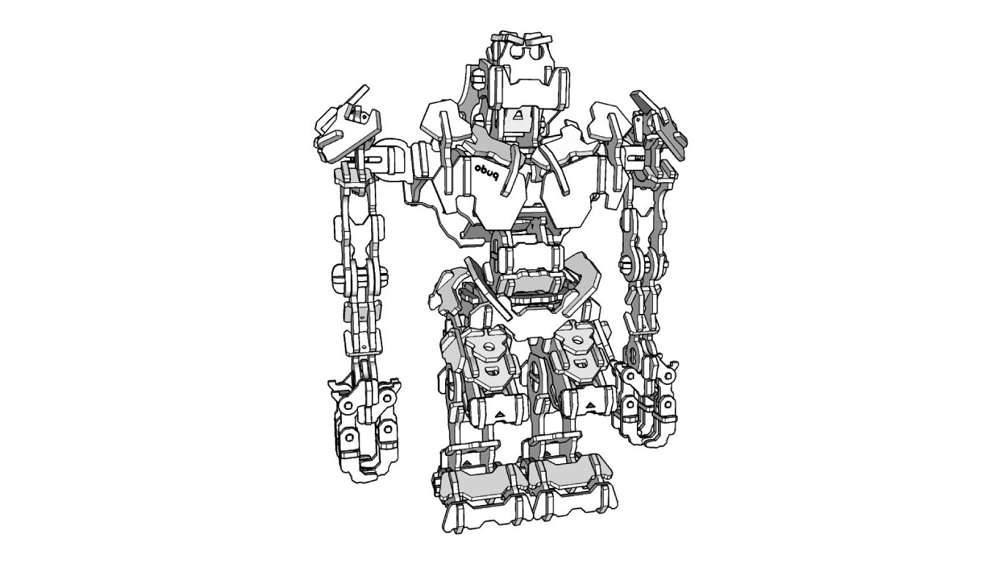

# Obot

More information and additional images:  
https://obuqdesign.wordpress.com/2023/11/07/obot/

 

## Details

| Property | Value |
|---|---|
| Type | Tridimensional model (232 pieces) |
| Designed for | 3mm mdf or plywood |
| Dimensions (on resting position) | Height: 270mm; Lenght: 100mm; Width: 220mm |
| Design file format | DXF R14 |
| Units | mm |
| Frame | 220x130mm (ReadyToCut layout \| x9 layouts) |
| Scalable | Yes (limited) |

 

 

  If you like this design and would like to support my work:
    
  https://buymeacoffee.com/obuq

 

 

#### Thank you to all the patrons that supported me when this design was initially posted on Patreon

 

James Elkins  
Roman Kupalov  
F  
patreon person  
Wouter Simons  
Bob-Bob Bob-Bob  
Peter Trzos  
Zak  
Julie Sturgeon  
Todd  
Rudenz Schulz  
Laura Culp  
Darkly Labs  
Aaron J Radke  
Renzo Ciarma  
Ray

